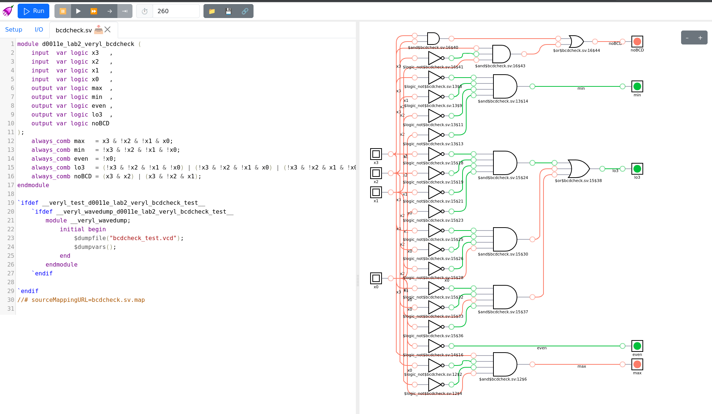
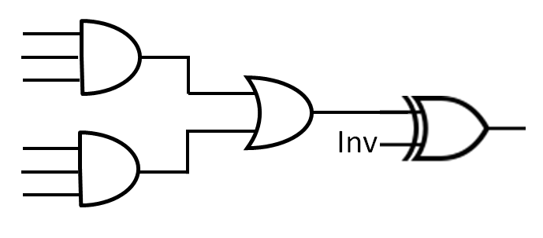
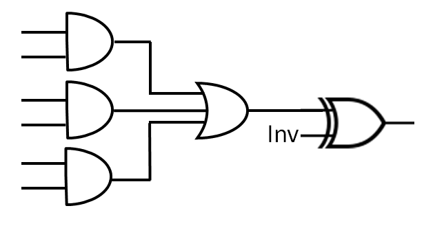

# D0011E - Laboration 2 (Design and verification of logic circuits) - Veryl Edition

This is a copy of the old/obsolete Lab 2 which is VHDL & Vivado based. If things are unclear can read the original instructions too, they might provide additional context / information.

In this Version of the Lab we will use the following Toolchain instead of Vivado:

**Implementation Language:** Veryl \
**Test Framework:** Veryl & Verilator \
**Waveform Viewer:** Surfer \
**RTL-Elaboration:** Yosys & [DigitalJS](https://digitaljs.tilk.eu/)

As you can see we are composing multiple tools to replace Vivado, bringing us closer to the ["do one thing, and do it well" philosophy](https://en.wikipedia.org/wiki/Unix_philosophy).

## Mini Crashcourse in Veryl, Verilator, Surfer, Yosys and [DigitalJS](https://digitaljs.tilk.eu/)

**Build:**
You can build your `*.veryl` files under `src` using `veryl build`. If the build succeeds you can find one `.sv` for each `.veryl` under `src`. The `.sv` file contains the corresponding SystemVerilog code for your Veryl code.

If you want to build a specific file you can run `veryl build src/filename.veryl`.
useful for when some file is not fully complete and you want to test a specific file.

**Test:**
You can test your Veryl code by running `veryl test`. It will run the tests defined in each of the files under `#[test(testname)]`.

same as build you can also run `veryl test src/filename.veryl` to only run the tests in a specific file.

**Waveforms**:
You can generate waveform files (`.vcd`) by running `veryl test --wave`. If successful you can find one `.vcd` for each `.veryl` under `src`. You can open these files using Surfer. To see all generated signals drag them from the left hand side of the screen to the right hand side.

**Netplan Viewing**:
To view a Netplan of your Code you can use [DigitalJS](https://digitaljs.tilk.eu/). First run `veryl build` to create SystemVerilog code out of your Veryl files. On the [DigitalJS](https://digitaljs.tilk.eu/) Website use the _"Drop your files here or click for a file dialog"_ section to open one of your `.sv` files. Next Click _Run_. If you have no errors you will get a Netlist view on the right hand side of the screen. Behind the scenes the tool is running [Yosys](https://github.com/YosysHQ/yosys) to parse your SystemVerilog file. You can now switch to the _I/O_ tab to play with the inputs and see how your circuit reacts.

it might look something like this:

## Preparation (to be completed BEFORE the practical lab session)

Complement the truth table from lab 1 with the function `hieq3: 1 if (x>=3) and (x<=9), 0 otherwise`.  Add the value of `hieq3` in the table below.

| Input  |  max  |  min  | even  |  lo3  | noBCD | hieq3 |
| :----: | :---: | :---: | :---: | :---: | :---: | :---: |
|   0    |   0   |   1   |   1   |   1   |   0   |   0   |
|   1    |   0   |   0   |   0   |   1   |   0   |   0   |
|   2    |   0   |   0   |   1   |   1   |   0   |   0   |
|   3    |   0   |   0   |   0   |   0   |   0   |   1   |
|   4    |   0   |   0   |   1   |   0   |   0   |   1   |
|   5    |   0   |   0   |   0   |   0   |   0   |   1   |
|   6    |   0   |   0   |   1   |   0   |   0   |   1   |
|   7    |   0   |   0   |   0   |   0   |   0   |   1   |
|   8    |   0   |   0   |   1   |   0   |   0   |   1   |
|   9    |   1   |   0   |   0   |   0   |   0   |   1   |
| 10 (A) |   0   |   0   |   1   |   0   |   1   |   0   |
| 11 (B) |   0   |   0   |   0   |   0   |   1   |   0   |
| 12 (C) |   0   |   0   |   1   |   0   |   1   |   0   |
| 13 (D) |   0   |   0   |   0   |   0   |   1   |   0   |
| 14 (E) |   0   |   0   |   1   |   0   |   1   |   0   |
| 15 (F) |   0   |   0   |   0   |   0   |   1   |   0   |

Obtain the Boolean equation for the new signal `hieq3` as a function of the inputs `x3`, `x2`, `x1`, `x0`. You will have to introduce the equation into the answer for Question 1, in the last part of the lab.

## Part 1

**a)**
Complete `bcdcheck3.veryl` by implementing the output `hieq3`, determined directly from the input signals.
Verify your design using the pre-defined tests below in the same file.

**b)**
Have a look how the "Elaborated Design" of this looks like in the [DigitalJS](https://digitaljs.tilk.eu/).

A problem with the solution in 1a is an unnecessary duplication of comparators. To avoid this, create a new file `bcdcheck4.veryl` so that `hieq3` is written by reusing the comparators from the calculations of `lo3` and `noBCD`. Change the module name to `bcdcheck4`. Simulate and verify your design, make sure to test all possible inputs. To check that you have reused the comparator, have another look at the “Elaborated Design” in [DigitalJS](https://digitaljs.tilk.eu/).

**c)**
Try to move the assignment of hieq3 by placing it above and below the assignments of the signals `lo3` and `noBCD`. Simulate your design. Does this change affect the behaviour of the entity, i.e. does the order of assignments in Veryl matter? Answer to Question 5 at the end of the lab.

## Part 2

**a)**
Design a Veryl module that corresponds to the logic function `f = bc'd' + a'd' + ac' + a'c` (without making any optimizations). Generate the RTL schematic using [DigitalJS](https://digitaljs.tilk.eu/). Try to run with and without Optimization (The Checkbox named _Optimize in Yosys_). Has the synthesis tool optimized the design? How? Answer to Question 6 at the end of the lab. You can find an implementation stub in `part2a.veryl`.

**b)**
Verify the correctness of the design by creating a truth table and comparing with a Simulation. Either do a Simulation with `veryl test --wave` and check the waveform in Surfer, or use the _I/O_ Tab in [DigitalJS](https://digitaljs.tilk.eu/) to test all combinations, or write down assertions (`$assert(f == y, "wrong result for a=x1, b=x2, c=x3, d=x4")`).

## Part 3

When designing hardware, we often need to express certain logic using a grid of PLD cells (PLD = programmable logic device). In this assignment, you will express the function f from 2a using the following PLD cell:

**a)** Write a Veryl module corresponding to the schematic of the PLD cell above. You can use the stub in `pldcell.veryl`. You can check if everything works as expected using DigitalJS.

**b)** Design a Veryl module for the logic function `f = bc'd' + a'd' + ac' + a'c` that uses a single PLD cell from 3a and no other logical circuits. You may, however, invert the input signals `(a,b,c,d)` before sending them to the PLD cell or set its inputs to constants `0` or `1`. Test whether you have implemented everything correctly either using waveforms, or using assertions against your implementation from 2a.

_Hint:_ you will need to perform Karnaugh minimization of the function `f`.

**c)**
Design a Veryl module for the logic function `g = a'b'c' + abcde` that uses two PLD cells from 3a. You may invert the input signals `(a,b,c,d,e)` if necessary before sending them to the PLD cell or set its inputs to constants `(0,1)`. You may also send the output from one cell as an input to another cell. Simulate and verify your design by adding `asserts`. You should write enough tests to make sure that the component is correct. If you want to test all possible inputs it will result in 32 test cases.

## Part 4

Let `x = (x3, x2, x1, x0)` be a BCD encoding of a number from `0` to `9`. Design a Veryl module that takes `x3, x2, x1, x0` as inputs and produces `y3, y2, y1, y0` as outputs, where `y = (y3, y2, y1, y0) = 9 – x`, i.e. y is the 9-complement of `x`. Use exactly four PLD cells depicted below, one for each bit of `y`. You may **not** invert the input signals before sending them to the PLD cells but you may set their inputs to constants `0` or `1`. Add your Implementation and test it, the same way you have done in the previous parts.

_Hint:_ write 4-bit encodings for each value of x and the corresponding value of y. Use these to formulate separate logic functions for each bit of y, using only x3, x2, x1, and x0 as inputs. You should also use the fact that x can only represent a number from 0 to 9, i.e. not all combinations of bits are possible as inputs.

## Part 5

### Question 1

What is the boolean equation for hieq3?

hieq3 = (x3 & !x2 & !x1) | (!x3 & x2) | (!x3 & !x2 & x1 & x0)

### Question 2

What builtin primitive types are predefined in Veryl? What are the differences between an Integer (for example `u32`) and a `logic` in Veryl?

Hint: Veryl Type can be found here: <https://doc.veryl-lang.org/book/05_language_reference/03_data_type/01_builtin_type.html>

Built-in primitive types: `logic`, `bit`, `u*`, `i*`, `f*`, `string`.

`logic` is a 4-state hardware signal type.  
`u32` is a 2-state unsigned integer type.

### Question 3

After creating `bcdcheck3.veryl` to use intermediate signals, compare `bcdcheck3.veryl` and `bcdcheck4.veryl` RTL schema. What are the differences and why do we want to you use intermediate signals?

`bcdcheck3` has duplicated comparator logic for `hieq3`.  
`bcdcheck4` reuses intermediate signals (`lo3`, `noBCD`), so it uses fewer gates and is simpler.

### Question 4

When you reused the comparators you had to add other logic gates. Then, was it a good decision to remove the comparators?

Yes. It was a good decision because it reduced duplicated hardware and total complexity.

### Question 5

Try to change the order of code by moving hieq3 above the assignment of the signals. Does this change the behavior?

No. The behavior does not change because Veryl assignments are concurrent.

### Question 6

After implementing and testing part 2a) in the lab specification, has the synthesis tool optimized the RTL design in some way? How?

Yes. Yosys removed redundant logic terms, so the optimized design uses fewer gates.

### Question 7

Create a truth table for `f`, as defined in the lab specification part 2a), and verify the design by comparing the truth table from the Preparation.

`f = bc'd' + a'd' + ac' + a'c`

| a | b | c | d | f |
|:-:|:-:|:-:|:-:|:-:|
| 0 | 0 | 0 | 0 | 1 |
| 0 | 0 | 0 | 1 | 0 |
| 0 | 0 | 1 | 0 | 1 |
| 0 | 0 | 1 | 1 | 1 |
| 0 | 1 | 0 | 0 | 1 |
| 0 | 1 | 0 | 1 | 0 |
| 0 | 1 | 1 | 0 | 1 |
| 0 | 1 | 1 | 1 | 1 |
| 1 | 0 | 0 | 0 | 1 |
| 1 | 0 | 0 | 1 | 1 |
| 1 | 0 | 1 | 0 | 0 |
| 1 | 0 | 1 | 1 | 0 |
| 1 | 1 | 0 | 0 | 1 |
| 1 | 1 | 0 | 1 | 1 |
| 1 | 1 | 1 | 0 | 0 |
| 1 | 1 | 1 | 1 | 0 |

Verified in simulation.

### Question 8

Show how you have minimized `f` to "fit" into the PLD cell you have implemented. Either you perform Karnaugh minimization or use boolean algebra.

I minimized f by grouping the 0 cells in a Karnaugh map (minimizing f' then inverting):

| ab \ cd | 00 | 01 | 11 | 10 |
|:-------:|:--:|:--:|:--:|:--:|
| 00      | 1  | 0  | 1  | 1  |
| 01      | 1  | 0  | 1  | 1  |
| 11      | 1  | 1  | 0  | 0  |
| 10      | 1  | 1  | 0  | 0  |

- Rows ab=00,01 column cd=01 → `a'c'd`
- Rows ab=11,10 columns cd=11,10 → `ac`

Minimized form:
- `f' = a'c'd + ac`
- `f = !(a'c'd + ac)`

This fits one PLD cell using those two product terms and `inv = 1`.
Verified with simulation/assertions.

### Question 9

Show the boolean equations for `y3`, `y2`, `y1`, `y0` for part 4. How did you get to these boolean expressions? How did you assure yourself that these are correct?

I derived the equations from the `y = 9 - x` truth table for valid BCD inputs (0–9):

| x | x3 | x2 | x1 | x0 | y3 | y2 | y1 | y0 |
|:-:|:--:|:--:|:--:|:--:|:--:|:--:|:--:|:--:|
| 0 | 0  | 0  | 0  | 0  | 1  | 0  | 0  | 1  |
| 1 | 0  | 0  | 0  | 1  | 1  | 0  | 0  | 0  |
| 2 | 0  | 0  | 1  | 0  | 0  | 1  | 1  | 1  |
| 3 | 0  | 0  | 1  | 1  | 0  | 1  | 1  | 0  |
| 4 | 0  | 1  | 0  | 0  | 0  | 1  | 0  | 1  |
| 5 | 0  | 1  | 0  | 1  | 0  | 1  | 0  | 0  |
| 6 | 0  | 1  | 1  | 0  | 0  | 0  | 1  | 1  |
| 7 | 0  | 1  | 1  | 1  | 0  | 0  | 1  | 0  |
| 8 | 1  | 0  | 0  | 0  | 0  | 0  | 0  | 1  |
| 9 | 1  | 0  | 0  | 1  | 0  | 0  | 0  | 0  |

Equations:
- `y0 = !x0`
- `y1 = x1`
- `y2 = x1 ^ x2`
- `y3 = !(x3 | x2 | x1)`

All inputs are non inverted. For `y2`, the XOR is handled by the XOR gate built into the PLD cell itself. Inputs 10–15 are invalid BCD and treated as don't cares.