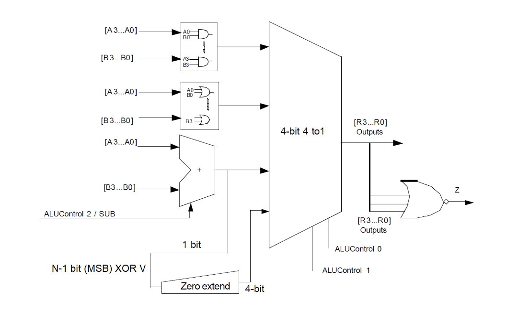
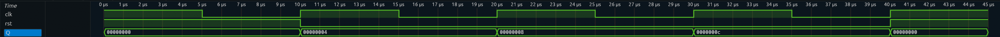

# D0011E Lab 3b Veryl Edition (32-bit ALU and Program counter)

The goal of this lab is to implement the ALU and the program counter for the single-cycle 32-bit MIPS processor. It also aims to familiarize the student with sequential circuits in Veryl.

## Part 1

The image below, from quiz 1, introduces a 4-bit ALU which supports ```AND```, ```OR```, ```ADD```, ```SUB``` and ```SLT``` (Set if Less Than) instructions with a zero flag output. The single-cycle MIPS processor has the same architecture.



Using Veryl, implement the entire ALU but for 32-bits. You will need to implement and test component by component. (```ArithmeticUnit```, ```ZeroExtend``` and ```Multiplexer```). The zero flag can be implemented at the main model ALU.

### ALU module (top level)

```
module Alu32 (
    A: input logic<32>,
    B: input logic<32>,
    Sub: input logic,
    Op: input logic<2>,

    R: output logic<32>,
    V: output logic,
    C: output logic,
    Z: output logic,
)
```

### Arithmetic module
```
module Arith32 (
    A: input logic<32>,
    B: input logic<32>,
    Sub: input logic,

    R: output logic<32>,
    V: output logic,
    C: output logic,
) 
```

### Zero extend module
```
module ZeroExtend (
    A: input logic,
    R: output logic<32>
)
```

### Multiplexer module
```
module FourToOneMux32 (
    A: input logic<32>,
    B: input logic<32>,
    C: input logic<32>,
    D: input logic<32>,

    Op: input logic<2>,

    R: output logic<32>,
) 
```

Hint: when modifying the module ```Adder``` from lab3a, you can use the following generate statement instead of manually instantiating 32 one-bit full adders:

```
for i in 0..32 :adders {
    inst full_adder_instance: FullAdder (
        ...
    );
}
```

Replace the dots with appropriate signals. To handle carry bits, you should create and use a 33-bit ```logic```, so that ```carry[0]``` is the carry-in to the first full adder, ```carry[1]``` is the carry-out from the first full adder and carry-in to the second fulladder, etc. Then ```carry[32]``` should be the carry-out from the 32nd full adder.

*Note*: Verilator cannot handle the intermediate ```carry``` signal being a flat logic vector. Because of this you will need to define ```carry``` as a bit array i.e. ```carry: logic[33]``` instead of ``` carry: logic<33> ```. You can also follow the path suggested by Verilator and disable the ```UNOPTFLAT``` lint, however this is not recommended.

## Part 2

MIPS processor uses a program counter which increments the memory address by 4 each clock cycle. By using the 32-bit adder, design and implement a model ```PCPlus4``` which consists of a 32-bit state register and a 32-bit adder. The model should increment its output by 4 after each rising edge of the clock ```clk```. A reset input ```reset``` should reset the model's output to zero if it is set to **low** state, asynchronously.

```
module PCPlus4 (
    Clk: input clock,
    Reset: input reset,

    Q: output logic<32>,
)
```

Implement the ALU model and the PCPlus4 model. Run it against the given test bench. There should be no assertion violations.


