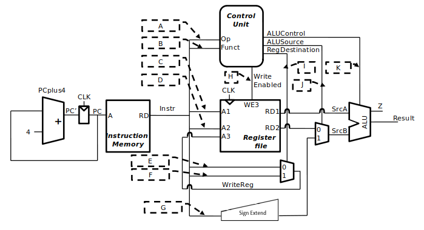

# D0011E Lab 4 (First MIPS version) Veryl Edition

The goal of this lab is to implement a simplified 32-bit MIPS processor. We only implement a subset of MIPS instructions (branch, store, and load instructions are added in lab 5). Data memory is also left out until lab 5.

Before starting, study `regfile.veryl` and `instr_mem.veryl` in `src`. You will need to understand them to continue. To check your understanding of the instructions in `instr_mem.veryl`, write a comment next to each instruction with its name, and the affected registers or values.

Add your ALU files from Lab 3b to the `src` folder. They should not need any modifications.

## Warning

A recent bug in Veryl has been fixed in the latest nightly. Make sure to update:

```
verylup install nightly
verylup update
verylup override set nightly
```

## Part 1

Implement a top-level module `Vips1`. This is the primary module where all components of the MIPS processor are instantiated. You can find a stub in `vips.veryl`.



It should include the following components: a register file (given), an ALU (from lab 3b), an instruction memory (given), the program counter from lab 3b, a control unit, a sign extend block, and the two multiplexers seen in the picture.

The debug signals (`dbg_reg` and `dbg_reg_data`) allow checking internal register state from the test bench. For example, after three clock cycles the value in `register1` should be `8`, which you can check using `assert` together with the debug signals.

Stubs for the control unit (`decoder.veryl`) and the SignExtend module (`extend16_to32.veryl`) are under `src/`. The multiplexer interfaces are up to you.

Supported instructions (R- and I-type):

- **ADD, ADDI, SUB, SLT, SLTI, AND, OR**

Other requirements:

- Executing unimplemented instructions should have no effect on stored values.
- The result from all instructions must be available in the register file in the next clock cycle.
- The clock may only be used for the register file and the program counter.

When implementing the control unit, refer to the lecture slides for its inputs/outputs and tables B.1 and B.2 in the textbook for `OP` and `FUNCT` codes.

## Part 2

- Add a test bench that executes the code stored in program memory.
- Simulate and manually verify that the resulting register values are correct.
- Write unit tests to allow automatic testing. Test all instructions of the program and write tests for the ControlUnit (ADD, ADDI, SUB, SLT, SLTI, AND, OR) and SignExtend.
