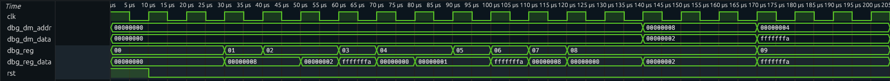

# D0011E Lab 5 (The improved MIPS version) Veryl Edition
The goal of this lab is to implement a data memory for the simplified 32-bit MIPS processor from Lab 4 and add support for the following instructions:
- ``lw`` and ``sw``
- ``beq`` and ``Jump`` to target

This lab should be completed individually, but cooperation is encouraged.
This lab is based on Lab 4, so you should start by importing the Veryl code from lab 4 into the given project. You do not have to import the `regfile` as one is in this repo already. (This is the same `regfile` as in Lab 4.)


## Warning
A bug was fixed in a recent nightly version, make sure you update to the latest Veryl nightly by running
```
verylup install nightly
verylup update
```
Also make sure you're using the nightly toolchain for this project by running
```
verylup override set nightly
```
*in this repo directory*.

## Preparation
Study full 32-bit MIPS in the lecture 10 slides. Answer the questions below.

**Q1.** Explain how the ``lw`` and ``sw`` instructions will work and show the active paths during each instruction.  You can add an image to help you answer the question.  

lw rt, offset(rs): The ALU adds rs and the sign-extended offset to get the memory address. The data memory is read at that address and the result goes into rt. Control signals: alu_source=1, mem_to_reg=1, write_enable=1.

sw rt, offset(rs): Same address calculation. The value of rt is written to memory at that address. No register is written. Control signals: alu_source=1, mem_write=1, write_enable=0.

**Q2.** Similarly explain how the ``beq`` instruction will work and show the active paths during its execution.  You can add an image to help you answer the question.  

The ALU subtracts rt from rs. If the result is zero the branch is taken. The branch target is PC+4 plus the sign-extended offset shifted left by 2. No register or memory is written. Control signals: alu_source=0, alu_sub=1, branch=1, write_enable=0. The PC takes the branch target when branch & zero = 1, otherwise PC+4.

**Q3.** Why should the main ALU not be used for the ``beq`` branch target computation?

The ALU is used to subtract rs - rt to check if they are equal. Since it is already doing that calculation you cant also use it for the branch address in the same cycle. So the branch target (PC+4 + offset<<2) is calculated separately with its own adder outside the ALU.

--- 

To improve the architecture further and for better use of the processor, the jump instruction must be supported. This will allow for larger jumps which increases the flexibility of the processor.

One of the unconditional jump instructions MIPS uses is ``J target`` (Jump to target). This J-type instruction consists of an opcode of 6 bits (000010) and an address, which is an absolute value (0, 1, 2, 3, ..., N) and occupies 26 bits in the instruction space. We know that MIPS uses word-aligned instructions (4-byte instruction). You can find the implementation of ``J target`` instruction in chapter 7 of the coursebook. You should use the last four bits of the current PC+4 as part of the target address. This will only be valid if the jumping range is not affected by these four bits. You must understand how this will function within your MIPS design. Refer to the book & the lecture slides to answer the questions below.

**Q4.** Explain how the ``J`` instruction will work and show the active paths during its execution. You can add an image to help you answer the question.

The 26-bit target field is shifted left by 2 and the top 4 bits of PC+4 are placed in front: {PC+4[31:28], instr[25:0], 00}. The PC takes this value next cycle. Nothing is written to registers or memory. Control signals: jump=1, write_enable=0.

**Q5.** How far is it possible to jump within a program using ``J`` and ``beq`` respectively?

J can reach any address within the same 256 MB region (2^28 bytes, or 2^26 word addresses). beq has a 16-bit signed offset so it can jump about ±128 KB relative to PC+4.

---

Complement the instruction decoder table from quiz 2 with 4 new signals for ``lw``, ``sw``, ``beq`` and ``J-instructions``. That is, the signals missing in the table below needed to provide the needed control for the new instructions. _(Signal names should match your design)_

| Instruction | Opcode | funct | WE | ALUControl | RegDestination | ALUSource | mem_write | mem_to_reg | branch | jump |
|:-----------:|:------:|:-----:|:--:|:----------:|:--------------:|:---------:|:---------:|:----------:|:------:|:---:|
| ADD         | 0      | 32    | 1  | 10 / sub=0 | 1 (rd)         | 0         | 0 | 0 | 0 | 0 |
| SUB         | 0      | 34    | 1  | 10 / sub=1 | 1 (rd)         | 0         | 0 | 0 | 0 | 0 |
| AND         | 0      | 36    | 1  | 00 / sub=0 | 1 (rd)         | 0         | 0 | 0 | 0 | 0 |
| OR          | 0      | 37    | 1  | 01 / sub=0 | 1 (rd)         | 0         | 0 | 0 | 0 | 0 |
| SLT         | 0      | 42    | 1  | 11 / sub=1 | 1 (rd)         | 0         | 0 | 0 | 0 | 0 |
| ADDI        | 8      | —     | 1  | 10 / sub=0 | 0 (rt)         | 1         | 0 | 0 | 0 | 0 |
| SLTI        | 10     | —     | 1  | 11 / sub=1 | 0 (rt)         | 1         | 0 | 0 | 0 | 0 |
| LW          | 35     | —     | 1  | 10 / sub=0 | 0 (rt)         | 1         | 0 | 1 | 0 | 0 |
| SW          | 43     | —     | 0  | 10 / sub=0 | X              | 1         | 1 | 0 | 0 | 0 |
| BEQ         | 4      | —     | 0  | 10 / sub=1 | X              | 0         | 0 | 0 | 1 | 0 |
| J           | 2      | —     | 0  | X          | X              | X         | 0 | 0 | 0 | 1 |

The values of the opcode and funct fields can be found in the MIPS green Card.

--- 

Using the supported instructions only, write an assembly program that divides two positive integers ``N`` (Numerator) and ``D`` (Denominator). Store the results ``Q`` (Quotient) and ``R`` (Remainder) in any two registers. Write the machine code for it. Remember that ``N < D`` and ``N = D `` are valid inputs. ``N`` and ``D`` should go into ``$a0`` and ``$a1`` respectively. ``Q`` and ``R`` should go into ``$v0`` and ``$v1`` respectively.

Use repeated subtraction to perform the division. See the algorithm below. **https://en.wikipedia.org/wiki/Division_algorithm#Division_by_repeated_subtraction**

```
Q := 0 
R := N

while R ≥ D do 
    Q := Q + 1
    R := R − D
end
```

**Q6.** Write the MIPS assembly code for your program below:
```mips
addi r12, r0, 0       # Q = 0
        addi r13, r0, N       # R = N
        addi r11, r0, D       # D = divisor
loop:   slt  r14, r13, r11    # r14 = (R < D)
        beq  r14, r0, body    # if R >= D go to body
        j    done             # R < D, exit
body:   addi r12, r12, 1      # Q++
        sub  r13, r13, r11    # R -= D
        j    loop
done:   sw   r12, Q_addr(r0)  # store Q
        sw   r13, R_addr(r0)  # store R

```

**Q7.** Write the machine code for your program below:
```mips
0x48: 0x200C0000  # addi r12, r0, 0      Q = 0
0x4C: 0x200D000C  # addi r13, r0, 12     R = N = 12
0x50: 0x200B0005  # addi r11, r0, 5      D = 5
0x54: 0x01AB702A  # slt  r14, r13, r11
0x58: 0x11C00001  # beq  r14, r0, +1
0x5C: 0x0800001B  # j    0x6C
0x60: 0x218C0001  # addi r12, r12, 1
0x64: 0x01AB6822  # sub  r13, r13, r11
0x68: 0x08000015  # j    0x54
0x6C: 0x200F007C  # addi r15, r0, 124
0x70: 0xADEC0000  # sw   r12, 0(r15)
0x74: 0x200F0078  # addi r15, r0, 120
0x78: 0xADED0000  # sw   r13, 0(r15)
(divisions 2 and 3 follow same pattern at 0x7C and 0xB0)
```

**Q8.** How many cycles are needed to the final result? Discuss.

Around 65 cycles from reset for all three divisions. The lab 4 program runs first (12 cycles), then the SW/LW part (4 cycles), then the beq loop (4 cycles). Each division loop iteration takes 5 cycles (slt, beq, addi, sub, j) so it depends on how big the quotient is. Division 1 needs 2 iterations so around 20 cycles, division 2 needs 1 so around 15, and division 3 exits straight away since 5 < 12 so around 10. More iterations = more cycles.

**Q9.** How can you leverage the debug statements to test internal signals of different components?

The dbg_reg input lets you pick any register to read on dbg_reg_data without affecting execution. Same for dbg_dm_addr and the data memory. In the test bench you change the selector before a clk.next() and assert the value after. This way you can check any register or memory word at any point without needing extra output ports.

## Part 1
Based on the ``regfile.veryl``, implement a data memory where data can be stored and fetched.

The memory should have the following interface:
```
module DataMem #(
    param Words: u32 = 32,
) (
    i_clk     : input  clock               ,
    i_reset   : input  reset_async_high    ,
    i_we      : input  logic               ,
    i_addr    : input  logic           <32>, // byte address, but only word operations supported
    i_data    : input  logic           <32>,
    i_dbg_addr: input  logic           <32>,
    o_data    : output logic           <32>,
    o_dbg_data: output logic           <32>,
) 
```

Remember that:

- Data writing is synchronous with the clock
- Data is written at the rising edge of the clock and when MemWE is high
- Data reading is asynchronous; data of the memory location (Address) is sent out at DataOut when MemWE is low.
- Furthermore, make sure that the address is in an accessible range.

You only need to support 32 words as memory space and you can assume that all accesses are word-aligned.

* Write a test bench to verify that the memory works as expected. You may base this on e.g. the test bench for your register file (i.e. testing of a clocked module). Don't forget the assert statements.

**Q10:** Describe how you made sure that the address is in an accessible range and argue why this solution is good/correct.

I check if i_addr is below 128 (which is 32 words times 4 bytes each). If the address is too high, writes dont happen and reads just return 0. The word index comes from bits [6:2] of the address which gives a 5-bit value, so it can only ever be 0 to 31 and wont go out of bounds.

## Part 2



The waveform shows register values stepping through r1 to r9 and data memory at addresses 8 and 4 after the SW/LW instructions. r8 reads back 2 from address 8 and r9 reads back -6 from address 4.

***When you are doing Part 2, 3 and 4, keep in mind that all programs should run after each other using a single test bench. It is fine to copy code if you find this easier. The easiest way is to put each program after each other in the program memory and then just making sure that the test bench runs for long enough. The only important thing is that when you push everything to gitlab, everything runs after each other.***

Implement support for ``lw`` and ``sw`` instructions according to your design in the preparation part. 

Copy your ```vips1.veryl``` to a file called ```vips.veryl```. Afterwards change the module definition to the following:

```
module Vips (
    i_clk         : input  clock               ,
    i_reset       : input  reset_async_high    ,
    i_dbg_reg     : input  logic           <5> ,
    i_dbg_dm_addr : input  logic           <32>,
    o_dbg_reg_data: output logic           <32>,
    o_dbg_dm_data : output logic           <32>,
)
```

Where ```dbg_dm_pos``` and ```dbg_dm_pos_data```are debugging signals for the data memory, similarly to how you used debug signals for the register in lab 4. You should use these signals, together with asserts, to verify the data memory behavior. You will also need to import all the other components into the lab 5 projects you used in lab 4, such as the ALU, PCPlus4, etc.

Use the file instr_mem.veryl and addt the following instructions.

```mips
< .. Lab 4 Program .. >
sw r2, 0(r7)  
lw r8, 0(r7)  
sw r3, 4(r9)  
lw r9, 4(r10)  
```

You only need to add the last four instructions to the old program.

* Simulate to verify that the program works as expected (i.e. that correct values are written to the register file and data memory). Take a screenshot and put it in the readme. Remember that no register values or data memory values should change after the program is done executing.
* Write unit tests to test that all registers contain the correct values once the program has finished executing.
* Do the same for the data memory.

## Part 3
Modify your MIPS to support ``beq`` and ``Jump to target``. Refer to the preparation to add all the necessary components and interconnections.

* Test your **full** control unit (which supports ``sw``, ``lw``, ``beq``, ``J``, ``add``, ``addi``, ``sub``, ``and``, ``or``, ``slt`` and ``slti``) in the given test bench. Don't forget to assert statements. This means that you should initiate a new control unit and test it separately from the rest of the MIPS. This can be done in the same test bench. You should not have to make a separate test bench. Define new signals in the test bench that is used to test the control unit, then change them in the test bench.
* Add the following two instructions to the end of the program from part 2 (after the SW/LW instructions):

```mips
sub r2, r2, r4
beq r2, r4, -2
```

## Part 4
***Read Part 4 and 5 in full before you start doing anything to make sure that you understand where to store the output.***

Test your design of the MIPS and program from the preparation to divide two integers ``N`` and ``D``. Add all 3 divisions defined below to the program memory containing the part 2 program. 

* Simulate to verify that the program works as expected (i.e. that correct values are written to the data memory positions). You should also make sure that the correct values are written to the registers. You are however free to choose in what registers you save the information. ***The values in the registers used in part 2 and 3 should not be touched.***

Add the following divisions to the program memory and test them in the same test bench. The values that should be tested are:
  1. N = 12, D = 5
  2. N = 12, D = 12
  3. N = 5, D = 12

Where they are running in the order of the list. Below you can see where the information should be saved after you have reached your condition (you cannot substract anymore from the numerator). In the following address in memory is position << 2 (multiplied by 4).

  1. For N = 12 and D = 5, the quotient (Q) should be stored in data memory position 31 and the remainder (R) in position 30.
  2. For N = 12 and D = 12, the quotient (Q) should be stored in data memory position 28 and the remainder (R) in position 27.
  3. For N = 5 and D = 12, the quotient (Q) should be stored in data memory position 26 and the remainder (R) in position 25.

This is done to simply the peer-review and subsequent grading.

## Part 5 Upload the project and the README file created during the lab, remember:
* Unit tests for a seperate data memory, a seperate control unit and program from part 2, 4 and 5.
* The full implementation of the MIPS, with the implementation of your divider. Verify that it works with the initial values:
  * N = 12, D = 5 -> Q in DM 31 and R in DM 30
  * N = 12, D = 12 -> Q in DM 28 and R in DM 27
  * N = 5, D = 12 -> Q in DM 26 and R in DM 25
* Answers to all the questions
* Screenshots of the result of the simulations for part 2, remember to show both the data memory and the register memory. To make it easy to read you can change the radix to signed decimal.

**Congratulations. You have made a general-purpose processor that can be configured on a Field-programmable gate array (FPGA).**
